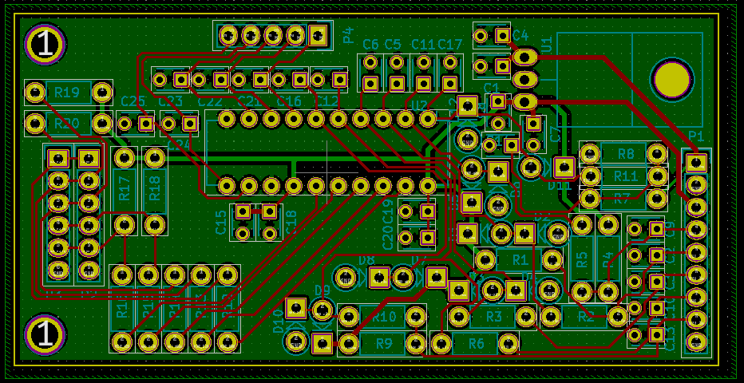
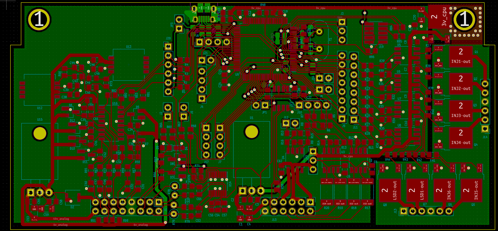
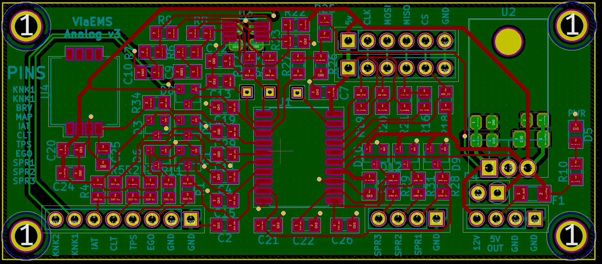
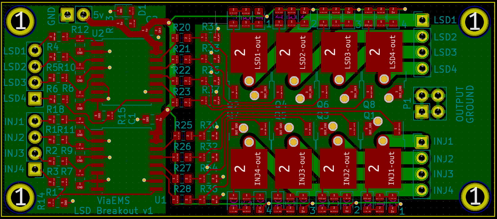
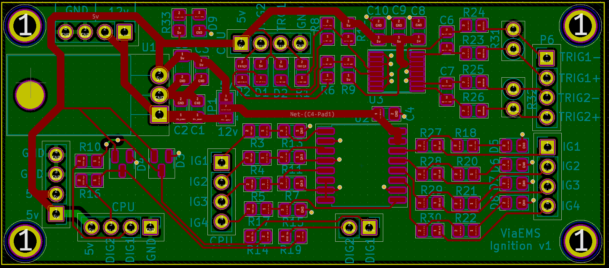

# viaems-boards
ViaEMS PCB Designs

In order of creation...
## Analog V1
 - Analog/ADC Core board based on a DIP TLC2543
 - All throughhole
 - Dedicated 5V supply
 - 4 Thermistor inputs
 - Inputs for EGO, BRV, MAP, TPS
 - 5 Spares

 

## IO V1
 - IO core board
 - 4x ignition outputs
 - 6x Low side drivers
 - CAN driver
 - Digital inputs

Do not use because:
 - 3v supply for CAN doesn't work at all
 - the FETs without gate drivers has poor performance from a 3.3 V
   microcontroller
 - No VR inputs

## Viaems V1
Original all-in-one board for ViaEMS
 - STM32F407VGT
 - 8x Low side outputs (fed by gate drivers)
 - 4x ignition outputs
 - 2x High side drivers
 - Dedicated MAP and AAP sensors on-board
 - AD7888 SPI ADC with thermistor and core inputs, one spare
 - CAN driver

 

Shouldn't be used anymore, but really only because the outputs chosen for test
trigger vs real triggers are different in firmware.  The board can be used
again with some minor tweaks (and I have used this board for years)

## Proto-stm32f427
Generic testing board for stm32f407, stm32f427, or, apparently, a gd32f470.

## Analog V2
Experiment board to prototype use of the MAX11632, and some knock sensing
equipment.  The ADC samples fast enough to dedicate two inputs to knock sensing,
which uses an op amp input filter.  Provides core inputs, a dedicated MAP
sensor, and an additional 8 spare inputs.

The board works fine, but I'm unlikely to commit to the MAX11632: since it seems
incredibly finicky with SPI noise, and it doesn't provide a good way to know if
there is an issue. It requires a setup command.  The knock sensing filter works
great though.  Ultimately issues with this chip pushed me to investigate the
TLV2553.

Also, its way too big.

## IO V2
** Do not use! **
Simple breakout board as an upgrade to IO V2:
 - IO Core board
 - 5v supply (and fused output)
 - 4x ignition outputs
 - 8x Low Side drivers (including 4 injectors)
 - 2x Digital inputs
 - 2 VR inputs

Experiment with replacing the 2-port gate drivers with the 4-port MIC4469
 variant.  This board was made mostly to experiment with various FETs.

This board is missing inline resistors between the MIC4469 and FETs.  This is
incredibly important for the VND7NV04 -- without it, the negative pulse from
injectors destroys the gate control logic and causes it to latch partly on.

Ultimately this board is also *way* too big.

## Analog V3
Another experiment, this time for the TI TLV2553.  This ADC has only 11 inputs,
and samples at 200kHz (vs 300 kHz of the MAX11632).  However, its control is
identical to the TLC2543, which has self test functionality.  It is still fast
enough to allow for two inputs to be sampled at 40 kHz (and the rest at 10 kHz).
 - Analog Core board based on TLV2553
 - Small form factor (78x34 mm)
 - 2x SPI headers to make debugging easier
 - dedicated 5v supply (and fused output)
 - 1x MAP input
 - 2x knock sensor inputs
 - 3x Spare inputs

 I decided (after the fact) to make all the other boards the same form factor

 

## LSD V1 (Split from IO V2)
The full contents of IO V2 could not fit on a single 78x34 board, so it is split
into two -- one for the low side drivers, one for everything else.  Other
lessons learned from IO V2 were to add gate resistors for the FETs, and that
indicator LEDs are worth the effort to plan into the design.
 - Low side/Injector Core board
 - Small form factor (78x34)
 - 4x Injector outputs
 - 4x LSD outputs (or an extra 4x injectors)
 - Indicator LEDs

 

## Pwr-Ign-V1 (Split from IO V2)
An upgrade from IO V2, with gate resistors fixed, indicator LEDs on all outputs
and trigger inputs
 - 5v supply
 - 2x VR inputs
 - 2x Digital inputs
 - 4x Ignition outputs

 

